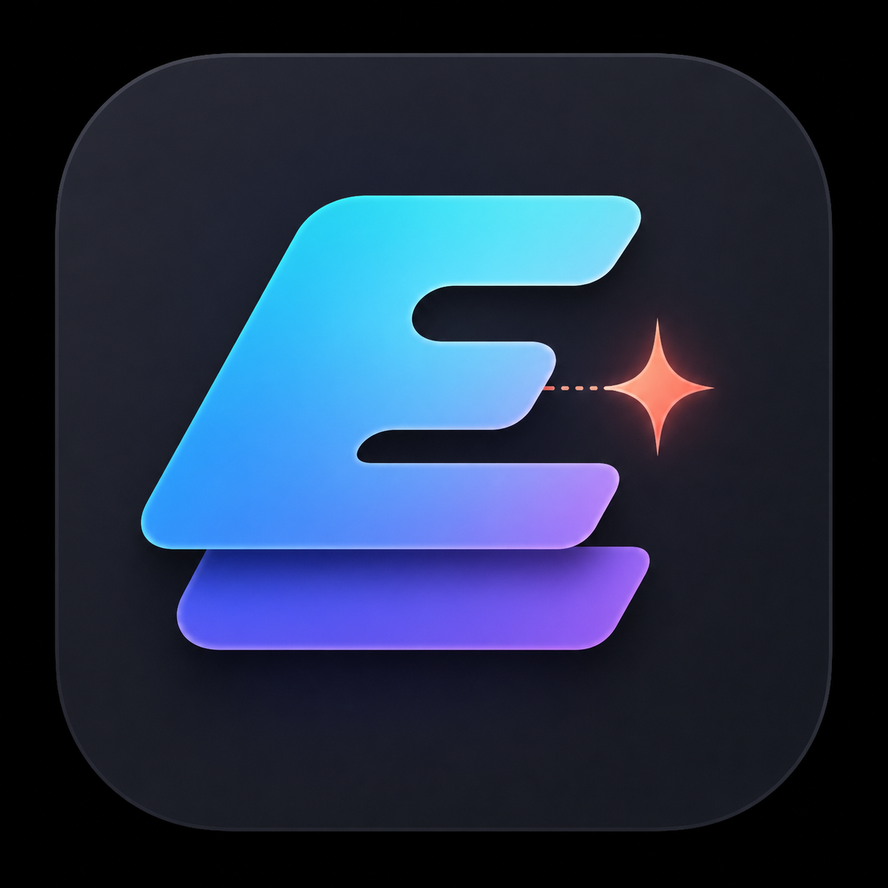

<p align="center">
  
</p>

<h1 align="center">Easyshop</h1>

<p align="center"><strong>Potenza a livelli. Zero attrito. Open source.</strong></p>

<p align="center">
  
  
  
</p>

Easyshop è un editor di immagini nativo per macOS pensato per lavori veloci: canvas dominante, livelli, testo editabile, regolazioni non distruttive e selezione on-device con Apple Vision ML. Nessun account, nessun caricamento obbligatorio nel cloud.

> **Stato:** Alpha 0.1 open source, non ancora consigliata come unico strumento per lavori commissionati. Il formato `.easyshop` conserva l’editabilità implementata; PSD è supportato con il percorso di compatibilità trasparente descritto sotto.

## Download

[Scarica Easyshop 0.1 Alpha](https://github.com/Scognamiglio1969/Easyshop/releases/download/v0.1.0-alpha/Easyshop-0.1.0-alpha.dmg)

Requisiti: macOS 14 o successivo. La build universale include Apple Silicon e Mac Intel. Non essendo notarizzata, al primo avvio usa **Control-click sull’app → Apri → Apri**; non serve il Terminale.

## Cosa offre

- livelli raster, testo e regolazioni;
- maschere, opacità e modalità di fusione;
- testo editabile su livello separato;
- selezioni rettangolari, ellittiche, libere e AI;
- regolazioni di esposizione, luminosità, contrasto, luci, ombre, gamma, livelli, curve, temperatura, tinta, HSL, vividezza, bilanciamento RGB, chiarezza, nitidezza e rumore;
- dimensioni in pixel o percentuale, DPI, proporzioni, ricampionamento Lanczos/bicubico/bilineare/pixel-art, preset, dimensione quadro a nove ancoraggi e ritaglio alla selezione;
- formato progetto aperto `.easyshop`;
- esportazione nei formati scrivibili da ImageIO, fra cui PSD, TIFF, JPEG, PNG, HEIC, AVIF, GIF, BMP, PDF ed EXR quando disponibili sul sistema;
- cronologia annulla/ripeti;
- drag-and-drop di immagini come nuovi livelli;
- modalità Focus e confronto prima/dopo.

## AI reale, dichiarata

La dicitura **ML** viene usata solo per operazioni basate sui modelli Apple Vision eseguiti sul dispositivo:

- selezione del soggetto o dell’istanza indicata;
- segmentazione persona e fallback di salienza;
- rimozione dello sfondo e separazione soggetto/sfondo;
- rilevamento del volto;
- correzione localizzata del soggetto basata sulla maschera Vision.

Tutti i risultati vengono inseriti come livelli o maschere separati. L’app non scarica immagini né invia telemetria.

## Strumenti locali che non sono AI

Easyshop li etichetta esplicitamente nell’interfaccia:

- miglioramento rapido: analisi statistica di luce e saturazione;
- correzione cielo: maschera cromatica euristica;
- upscale preciso: Lanczos con nitidezza;
- restauro rapido: preset non distruttivo di rumore, contrasto e dettaglio;

Non è presente un chatbot simulato: Easyshop chiama “AI/ML” solo un percorso che ha realmente usato un modello Apple Vision.

Modelli Core ML opzionali per inpainting, super-resolution e restauro neurale sono in roadmap; quei nomi non verranno usati prima che modelli, licenze, hash e test siano pubblici.

## Compatibilità dei file

| Formato | Apertura | Salvataggio/esportazione | Note |
|---|---:|---:|---|
| `.easyshop` | Completa | Completa | Livelli, testo, maschere e regolazioni editabili |
| PSD | Composito 8-bit | Livelli raster compatibili | I livelli Adobe non vengono importati; testo e regolazioni Easyshop vengono rasterizzati in export |
| PSB | Composta, se decodificato da macOS | In roadmap | I file molto grandi richiedono un codec dedicato |
| TIFF | Sì, convertito nel workflow interno 8-bit | Sì, appiattito | Le pagine multiple vengono importate come livelli; ICC/16-bit/CMYK non sono garantiti |
| JPEG/PNG/HEIC/AVIF/GIF/BMP | Sì | Sì, se supportato dal sistema | Formati appiattiti |
| RAW | In base al decoder macOS, rasterizzato | Esportazione in altro formato | Non è un convertitore RAW; sviluppo non distruttivo avanzato in roadmap |
| PDF/SVG | Importazione raster | PDF disponibile | Risoluzione scelta dal decoder di sistema |
| EXR/HDR | In base al decoder macOS | EXR quando disponibile | Percorso HDR evolutivo |

Un PSD può contenere funzioni proprietarie non documentate o non equivalenti. Easyshop mostra sempre l’immagine composta quando macOS riesce a decodificarla; il file originale non viene alterato. Durante l’esportazione, testo e regolazioni vengono rasterizzati nel PSD per preservare l’aspetto, mentre il progetto `.easyshop` resta la sorgente completamente editabile.

## UX: semplice per scelta

- **Canvas-first:** l’immagine resta al centro, senza una parete permanente di pannelli.
- **Inspector adattivo:** mostra solo i controlli utili al livello selezionato.
- **Context Flow:** quando esiste una selezione compaiono accanto al canvas solo le azioni pertinenti.
- **Isole mobili:** strumenti e inspector possono essere trascinati e richiusi per restituire spazio alla fotografia.
- **Progressive controls:** la vista è essenziale, ma livelli e curve avanzate restano a un clic.

## Compilazione per sviluppatori

```bash
Scripts/run-tests.sh
Scripts/build-app.sh
```

Gli artefatti vengono creati in `outputs/`. Gli utenti finali non devono usare il Terminale: installano Easyshop trascinando l’app dal DMG in Applicazioni.

Per una distribuzione pubblica senza avvisi Gatekeeper occorrono firma Developer ID e notarizzazione Apple. Il progetto non dispone di credenziali Apple Developer: la Developer Preview usa una firma ad hoc, non contiene segreti e richiede Control-click → Apri al primo avvio.

## Contribuire

Consulta [CONTRIBUTING.md](CONTRIBUTING.md), [SECURITY.md](SECURITY.md) e la [roadmap](docs/ROADMAP.md). L’architettura è descritta in [docs/ARCHITECTURE.md](docs/ARCHITECTURE.md).

## Licenza

Easyshop è distribuito con licenza [MIT](LICENSE).
